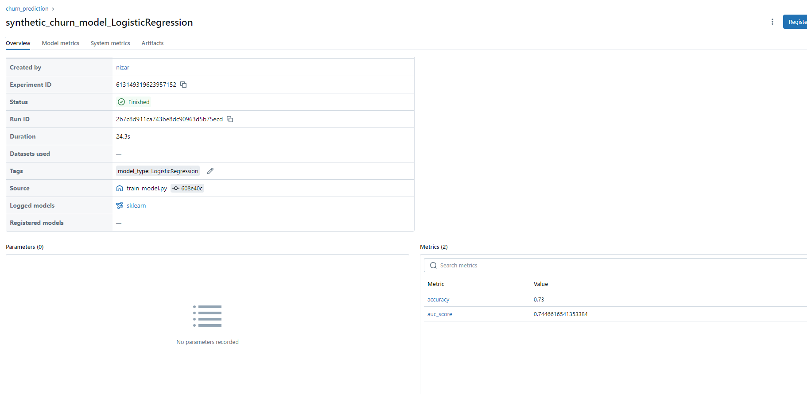
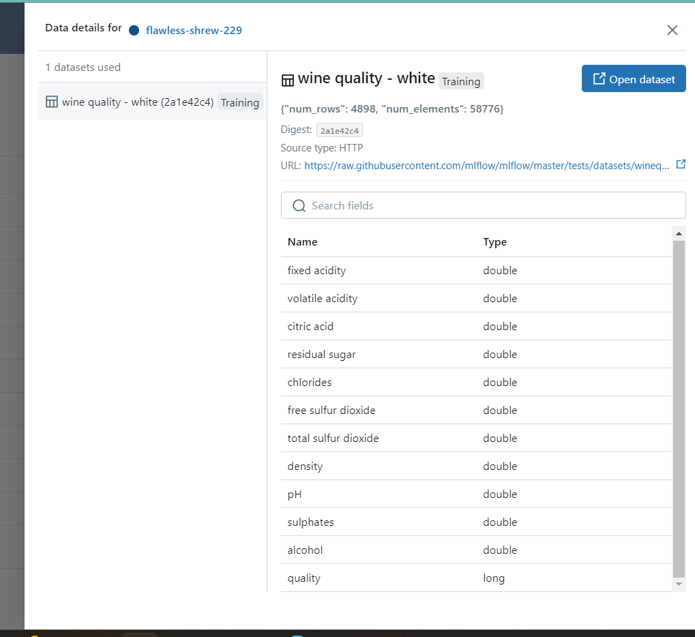
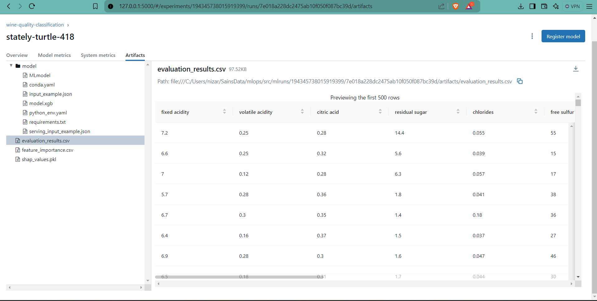

# ML-Ops-Intro
Mata Kuliah Kapita Selekta - Sains Data

Environtment Setup

Task 1: Synthetic Data Results

Regresi Logistik lebih baik karna jika dibandingkan dengan random forest, akurasi dan auc score dari regresi logistik lebih besar.

Task 2:

